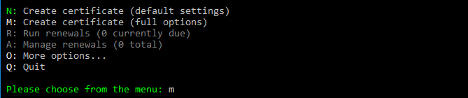
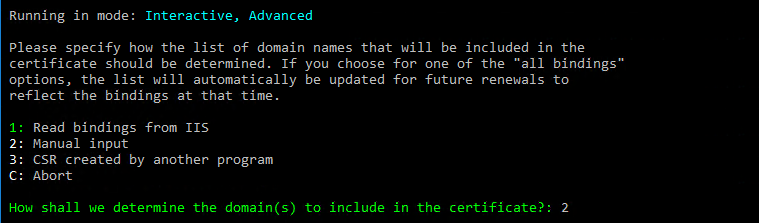
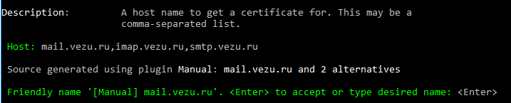
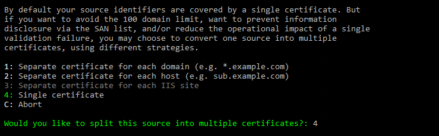
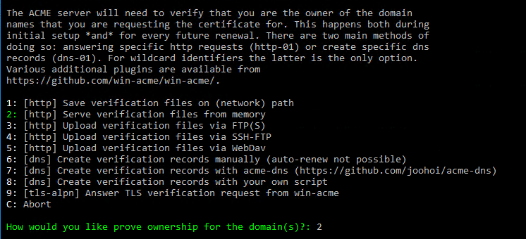
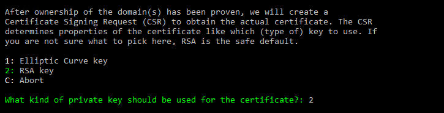

# Обновление SSL-сертификата Let's Encrypt с помощью Win ACME (Standalone-режим)

  


## Подготовка
1. **Скачайте Win ACME**  
   - Загрузите последнюю версию с [официального сайта](https://www.win-acme.com/).  
   - Распакуйте архив в удобную папку (например, `C:\wacs`).  

2. **Остановите веб-сервер**  
   - Если сертификат обновляется в standalone-режиме, убедитесь, что веб-сервер (IIS, Apache, Nginx) не использует порты **80** и **443**.  

## Обновление сертификата
1. **Запустите Win ACME**  
   - Откройте командную строку (`cmd`) от имени администратора.  
   - Перейдите в папку с Win ACME:  
     ```cmd
     cd C:\wacs
     ```
   - Запустите клиент:  
     ```cmd
     wacs.exe
     ```

2. **Выберите действие**  
   - В меню выберите:  
     ```
     M: Create a new certificate (with advanced options)
     ```
   - Если сертификат уже существует, можно выбрать:  
     ```
     R: Renew specific certificates
     ```
     

3. **Настройка сертификата**  
   - Выберите способ получения списка доменных имён для добавления в сертификат          `1`-режим получения из привязок **IIS**,`2` -ввод доменных имён вручную `3` -получение списка созданного в другой программе и `C` -отмена. Выбираем `2`.  
   
   - Введите доменые имена поочереди через запятую (например, `example.com, www.example.com`).
     
   - Выберите количество сертификатов для вашего сервера. `1`-отдельный сертификат на каждый домен, `2`-отдельный сертификат на каждый хост, `3`-отдельный сертификат на каждый сайт **IIS**,`4`-один сертификат.
   

4. **Дополнительные настройки**  
   - Укажите способ проверки владения доменным именем:
     
   - Настройте автоматическое обновление (рекомендуется).
     

5. **Завершение**  
   - Win ACME проверит домен, получит сертификат и сохранит его.
     
   - Если используется IIS, клиент может автоматически привязать сертификат.  

## Настройка сервера
1. **Обновите привязки**  
   - Для IIS: откройте **IIS Manager** → **Привязки сайта** → выберите новый сертификат.  
   - Для других серверов (Nginx/Apache) скопируйте файлы:  
     - `certificate.pem` → ваш `domain.crt`  
     - `privatekey.pem` → ваш `domain.key`  
     - `chain.pem` → цепочка доверия (если требуется).  

2. **Перезапустите сервер**  
   ```cmd
   iisreset /restart


[def]: https://img.shields.io/badge/Win_ACME-v2.2.0-blue