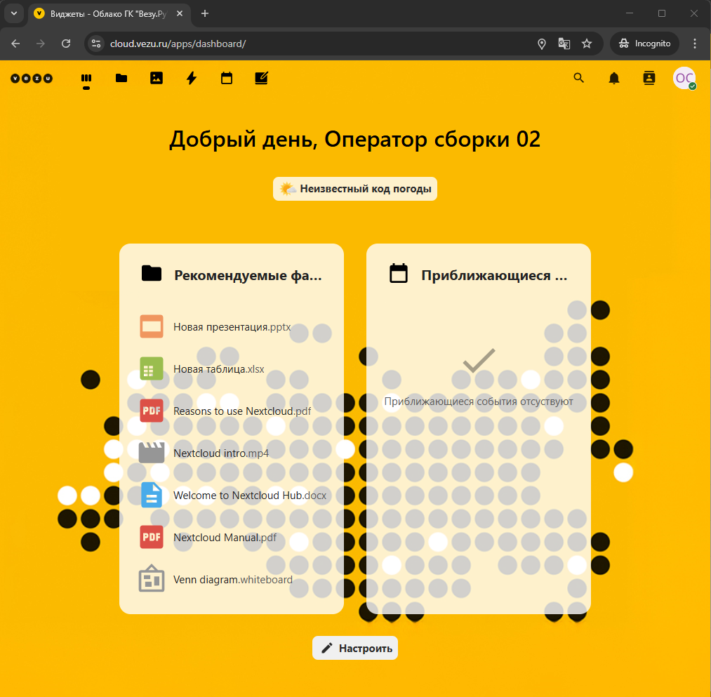
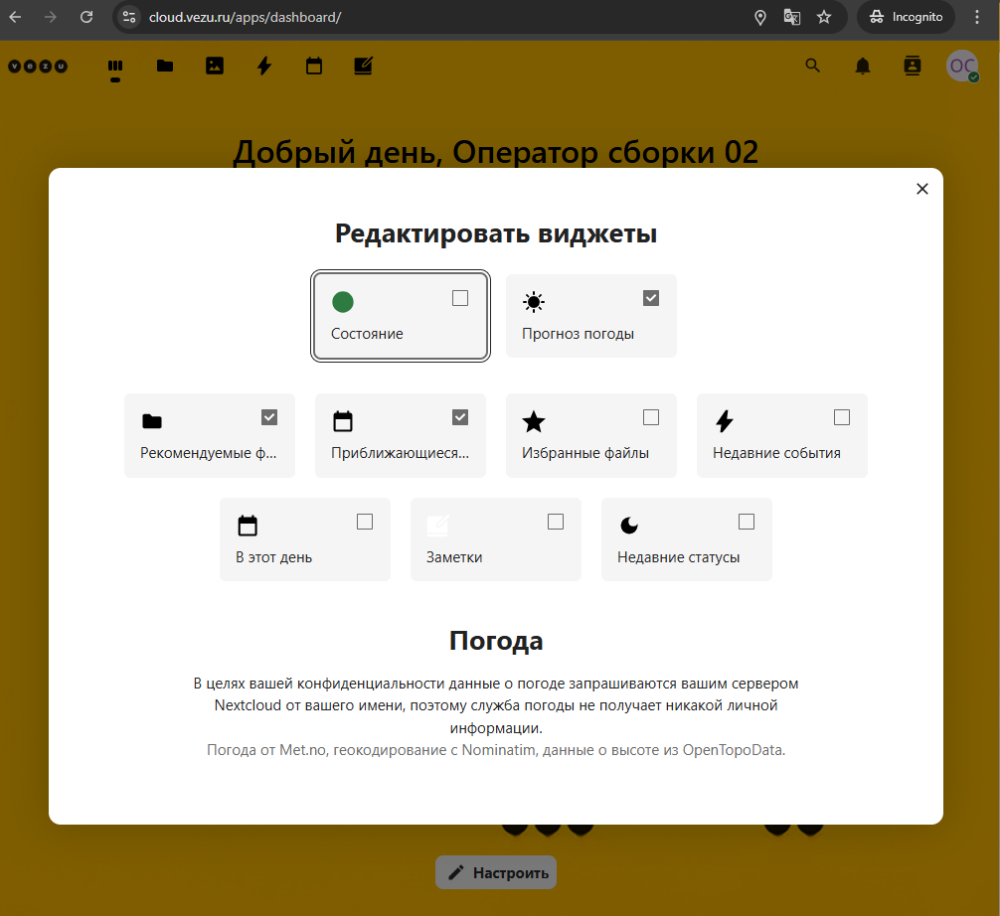
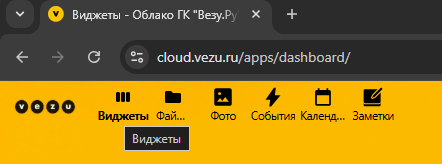
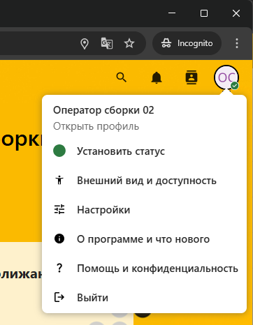
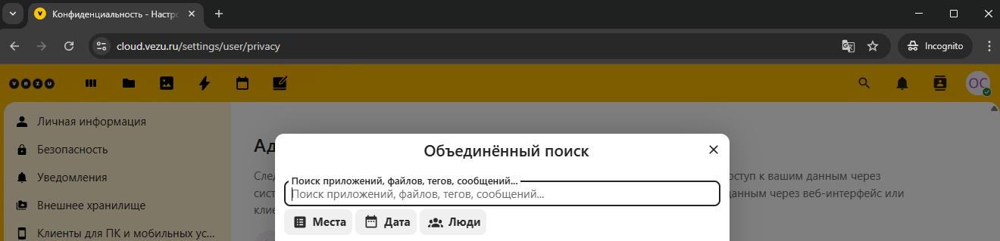
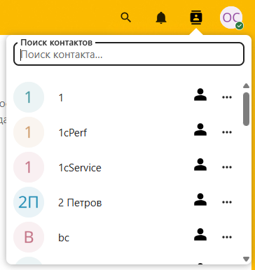
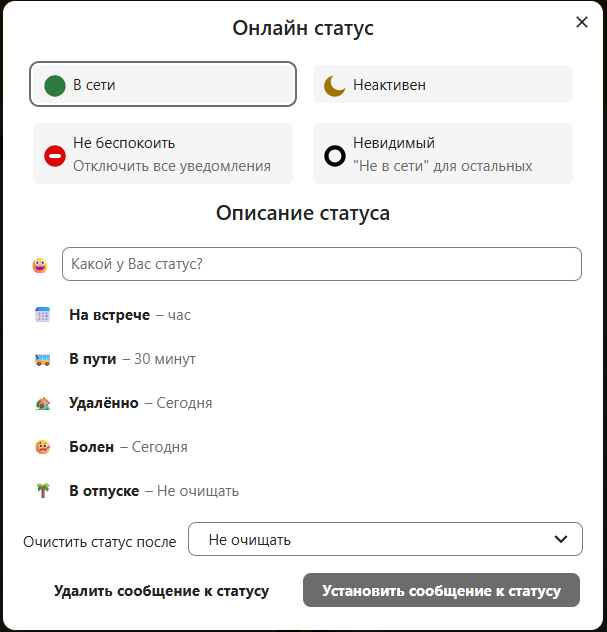
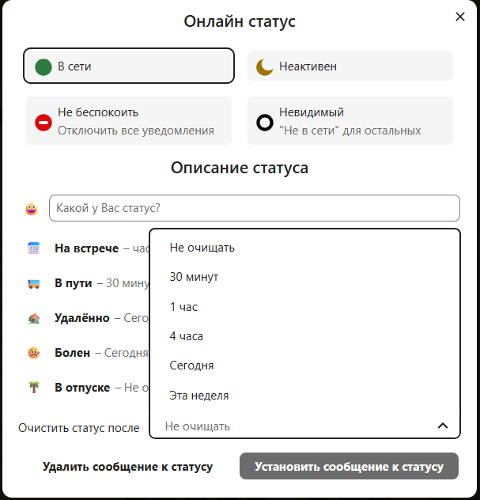

# Общее описание интрефейса облака Cloud.vezu.ru

 

## Стартовая страница
1. **Первоначальный вид рабочего пространства при ходе в облако** 
   
   - Слева вверхнем углу основные разделы облака  
   - Справа в верхнем углу Поиск, Уведомления, Лента, Настройки профиля.
   - В центе будут отображаться настраиваемые виджеты.
   - В низу кнопка выбота виджетов которые доступны для отображения на стартовой странице.
      

2. **Основные разделы облака** (в верхнем левом углу)
      
      
   - `Виджеты`: Отображает виджеты также как и на стартовой странице.  
   - `Файлы`: Основной разде по работе с файлами
   - `Фото`: Основной раздел по добавлению и простейшему редактированию изображений и видео.
   - `События`: Раздел с стекущими событиями (Журнал событий)
   - `Календарь`: Раздел для управления календарём и добавления событий по дате
   - `Заметки`: Раздел для добавления и обмена заметками

3. **Настройки профиля** (в верхенем правом углу)
   
   - 
   - `Поиск`: Поле поиска по сайту облака.
       
   - `Уведомления`: Список последних уведомлений о событиях.
   - `Контакты`: Поиск контактов по сайту.
      
      
    - `Установить статус`: В настройках профиля пользователя.
       
    - можно установить статус который будет отображаться у пользователей группы

4. **Настройки профиля пользователя**  
   - `Личная информация`: Нужно добавить адрес электронной почты Имя Фамилию,телефон остальное по желанию
   
      
   - `Безопасность`: Можно оставить как есть. Дополнительных действий не требуется.
   - `Уведомления`:
      
      
      
      Можно установить каким образом будут отправляться уведомления всплывающими окнами и/или сообщениями по эл.почте.
   - `Внешенее хранилище`:
      
      Позволяет подключить общую папку расположенную на сервере
      
   - `Клиенты для ПК и моб.устройств`:
      Отображает доступные для разных платформ приложения позовляющие работать с файлами. (Редактирование документов офис **онлайн** вомзожно только с ПК/ноутбук/планшет, на смартфоне не гарантируется. Т.е. на тлф лучше установить бесплатный редакор/просмотр документов Microsoft Excel, Microsoft Word, Microsoft PowerPoint если это необходимо)
      
      
   - `Общий доступ`:
      Позволяет обмениваться файлами между участинками группы.

      
   - `Внешний вид и доступность`:
      Настройки темы рабочего стола

      
   - `Доступность`:
      Можно установить рабочие часы для отображения когда вы в сети/работаете

      
   - `Обработка файлов`:
      Не требует настройки
   - `Конфидинциальность`:
      Ознакомительный раздел о месте хранения перс.данных. Не требует настройки.

---------------------------------------------------------------------------------------------   

5. **Далее**  
   - 📂 [Работа с файлами](./Работа_с_файлами.md)
   - 📂 [Работа с изображениями](./Работа_с_изображениями.md)
   - 📂 [Работа с событиями](./Работа_с_событиями.md)
   - 📂 [Работа с календарём](./Работа_с_календарём.md)
   - 📂 [Работа с заметками](./Работа_с_заметками.md)

   
 