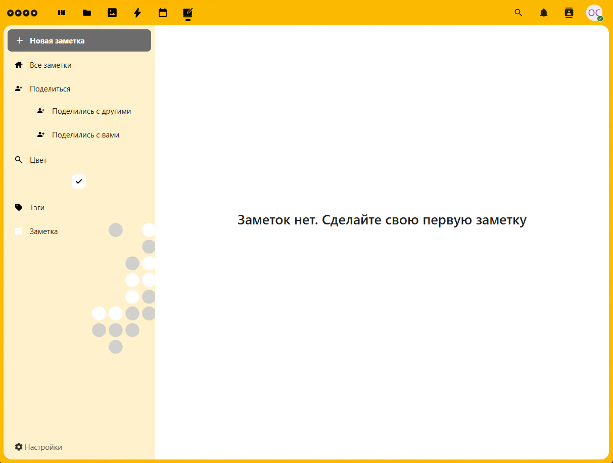
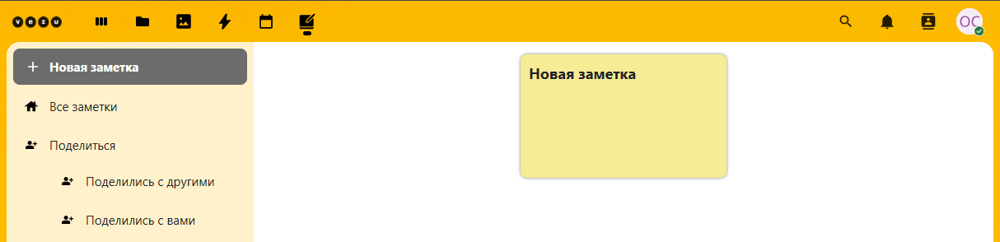
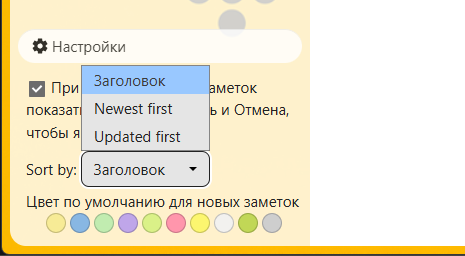
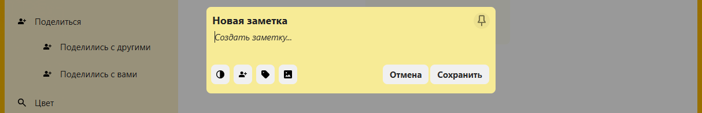
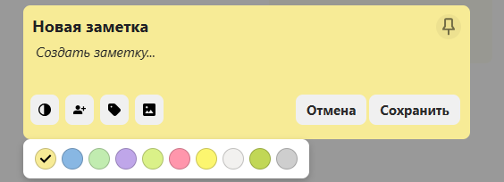
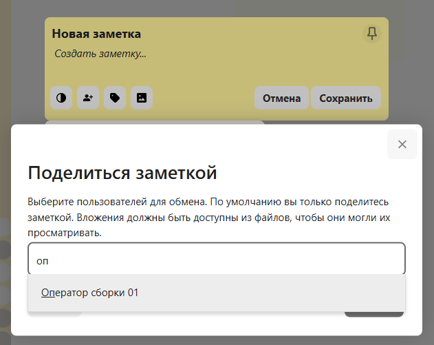
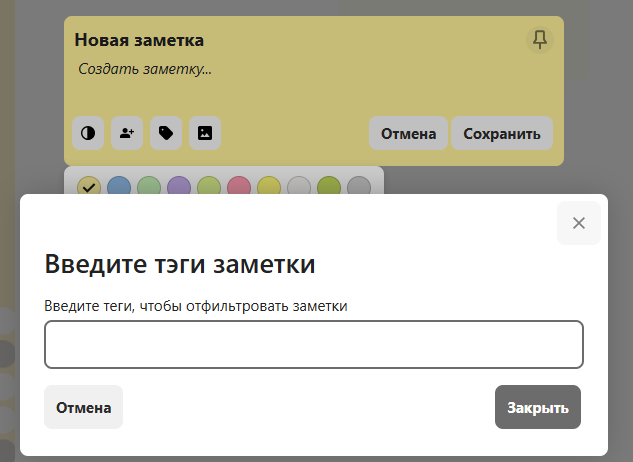
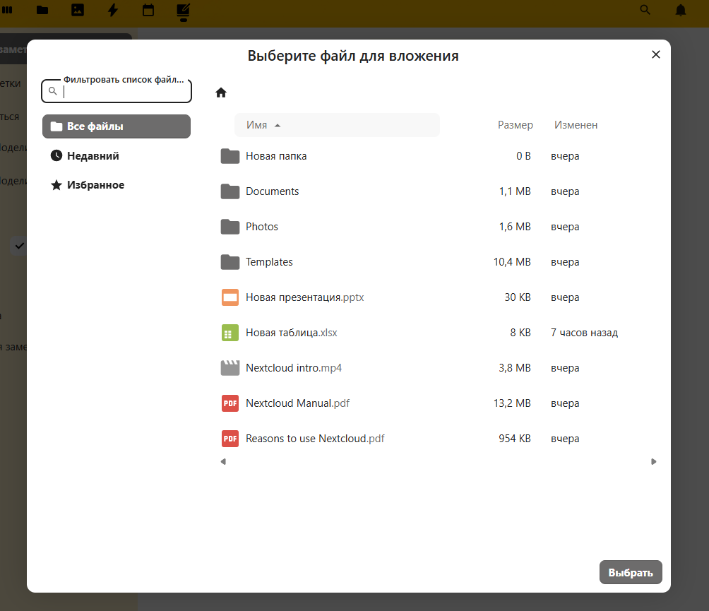

# Общее описание интрефейса облака Cloud.vezu.ru

 

## Просмотр и работа с `Заметки`
1. **Первоначальный вид рабочего пространства Заметки** 
   - Основное окно **Заметки**
   
   
   - Пункт меню в левой колонке `Новая заметка` создаёт новую заметку.

         
   - Пункт меню в левой колонке `Все заметки` отображает все доступные заметки.
    
   - Пункт меню в левой колонке `Поделиться` отображает все доступные заметки в подменю **Поделились с другими** те заметки которыми вы поделились с другими пользователями.
   **Поделились с вами** те заметки которыми поделились с вами другие пользователи.

   - Пункт меню в левой колонке `Цвет` позволяет задать цветовую метку заметкам.
   - Пункт меню в левой колонке `Тэг` позволяет задать тэг заметкам.
   - Пункт меню в левой колонке `Заметка` отображает отображает только созданные вами заметки
   - Пункт меню в левой колонке `Настройки` позволяет задать отображение заметок.

           
2. **Создание заметки**    
   - При нажати на кнопку `+ Новая заметка` откроется окно создания новой заметки  

     
   - В нём можно задать цвет заметки

      
   - Поделиться заметкой с другими пользователями

      
   - Добавить тэг к заметке
      
      
   - Прикрепить файлы к заметке

      

---------------------------------------------------------------------------------------------   

5. **Далее**  
   - 📂 [Работа с файлами](./Работа_с_файлами.md)
   - 📂 [Работа с изображениями](./Работа_с_изображениями.md)
   - 📂 [Работа с событиями](./Работа_с_событиями.md)
   - 📂 [Работа с календарём](./Работа_с_календарём.md)
   - 📂 [Работа с заметками](./Работа_с_заметками.md)
---
🔙 [Назад к 📂 Общее описание](./Общее_описание.md)   

   
 