# Общее описание интрефейса облака Cloud.vezu.ru

 

## Работа с `Изображениями`
1. **Первоначальный вид рабочего пространства Фото** 
   
   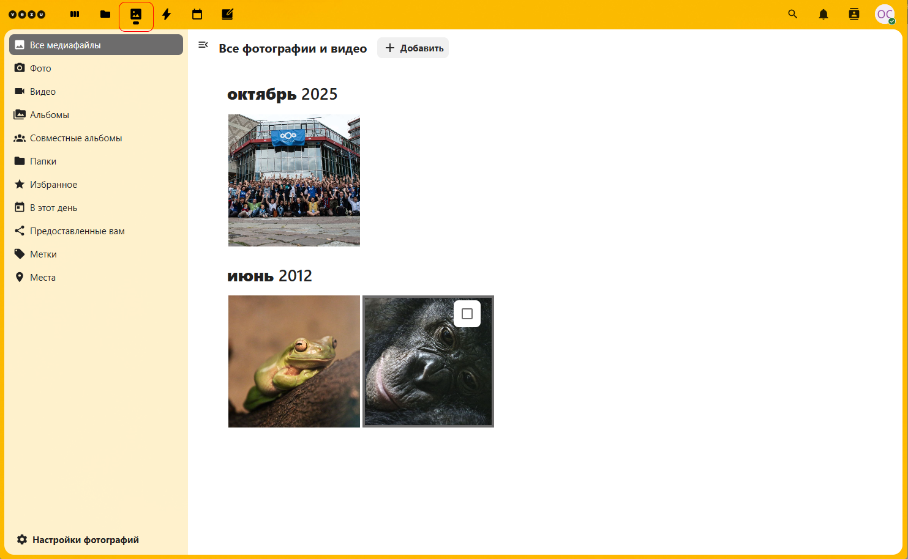
   
   - Пункт меню в левой колонке `Все медиафайлы` отображает все доступные медиафайлы и папки пользователя   
   - Пункт меню в левой колонке `Настройка фотографий` позволяет настроить вид папок и файлов в основном рабочем пространстве справа.
  
2. **Создание нового элемента** (в верхну под заголовком кнопка `+ Новый`)
   
   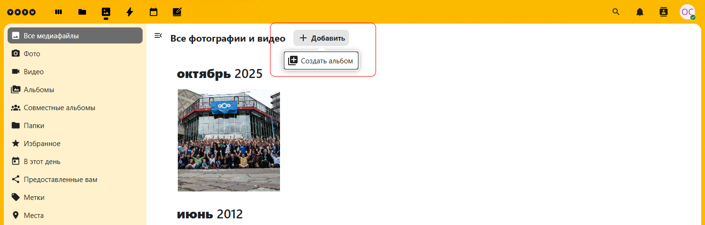
   
   - `+ Добавить`: содержит список действий по типу создания новых элементов.  
   - `Создать альбом`: позволяет добавить новый альбом для медиафайлов.

      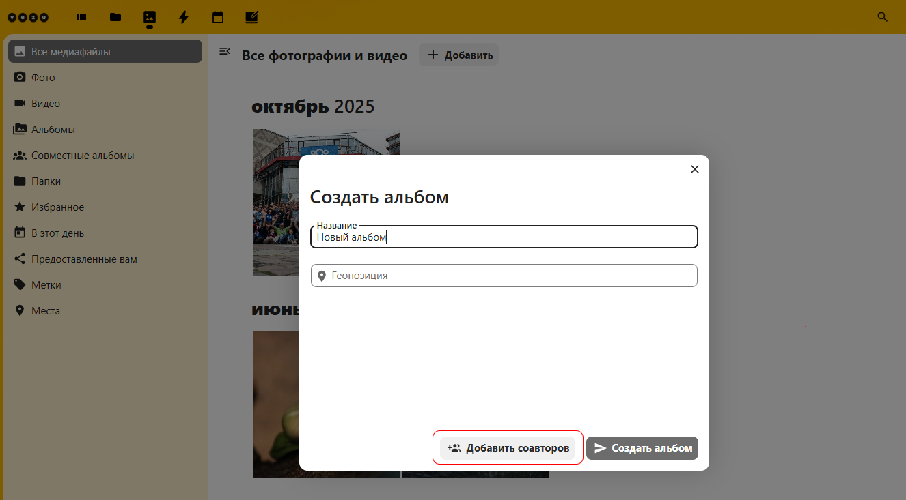
   - `Добавить соавторов`: поле для указания соавторов альбома, которые смогут редактировать альбом (кнопка станет активной после ввода названия альбома).

      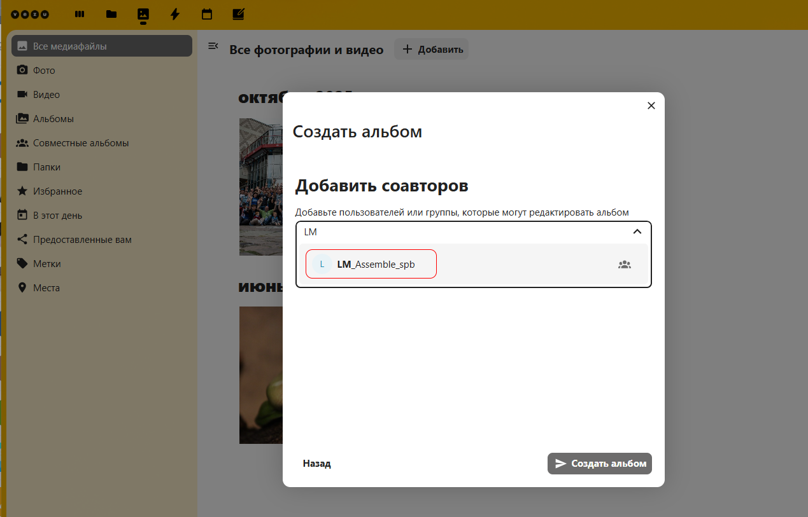
   - `Фото`: отображает все доступные файлы изображений
   - `Видео`: отображает все доступные видеофайлы
   - `Альбом`: отображает только все личные альбомы
   - `Совместные альбомы`: отображает только альбомы с совместным доступом
   - `Папки`: для загрузки изображений с компьютера
   - `Избранное`: отображает медиафайлы добавленные в **избарнное**
   - `В этот день`: отображает добавленные файлы по дням недели
   - `Предоставленные вам`: отображает только файлы предоставленные вам другими пользователями.
   - `Метки`: отображает медиафайлы с отметками
   - `Места`: отображает медиафайлы с добавленными геометками
3. **Просмотр изображений** 
   - Для редактирования изображений достаточно кликнуть по изображению. Станет доступна палитра дополнительных функций просмотора и редактирования изображений. 
    
     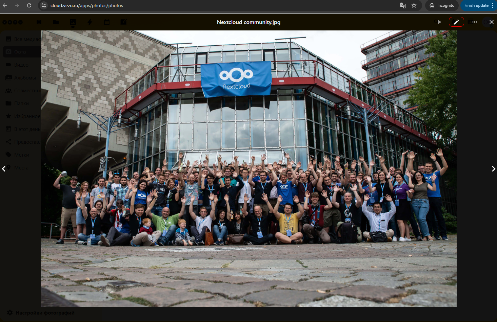
     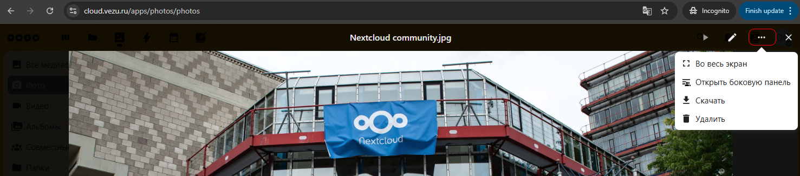
   - `Открыть боковую панель` открывает дополнительную область для параметров работы с изображнием
      Где можно посмотртерь или скачать медиафайл
      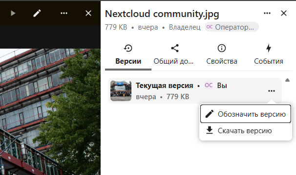
   -  Установить параметры общего доступа к медиафайлу 
      
      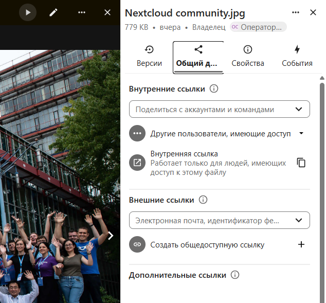
   - Можно поделиться файлом с внешними пользователями **не имеющими** учётной записи облака **Cloud.vezu.ru**. Где вы можете задать срок действия ссылки для доступа к медиафайлу, а также возможноность редактирования файла.

      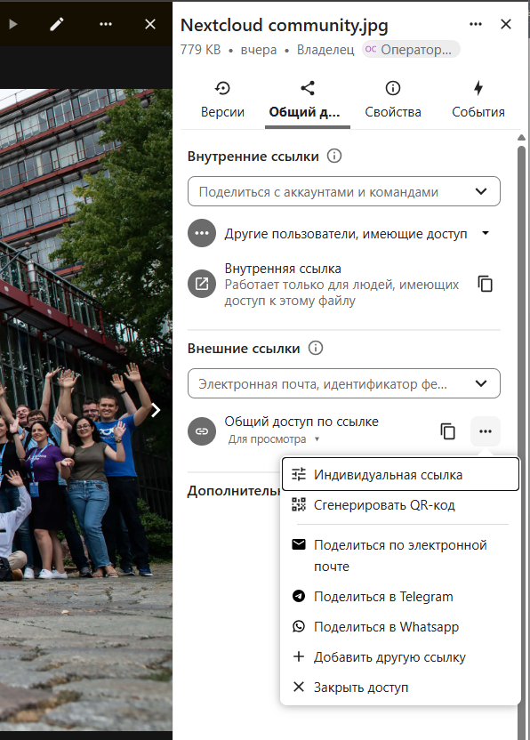
      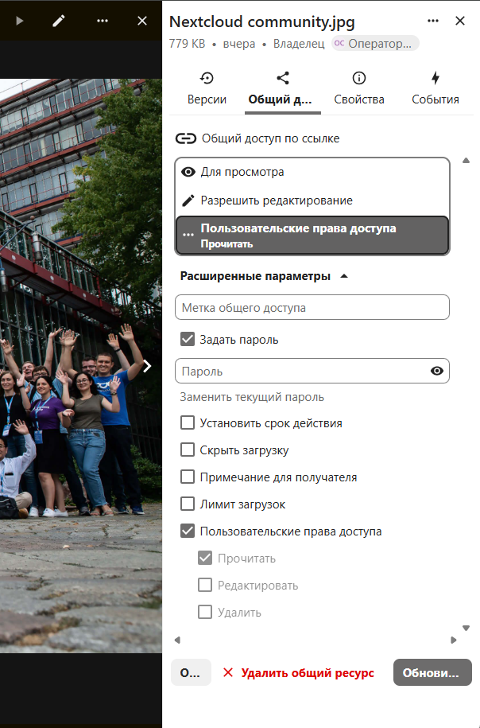 
   -  Просмотреть действия совершённые над файлом
      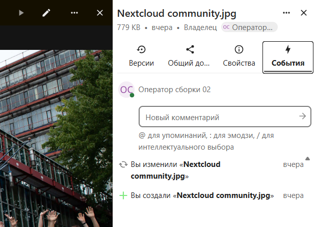   

4. **Редактирование файла изображения**  
   - Для перехода в режим редактирования изображения нужно кликнуть на иконке:
   
     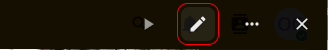 
   - Откроется палитра с инструментами редактирования изображений

      <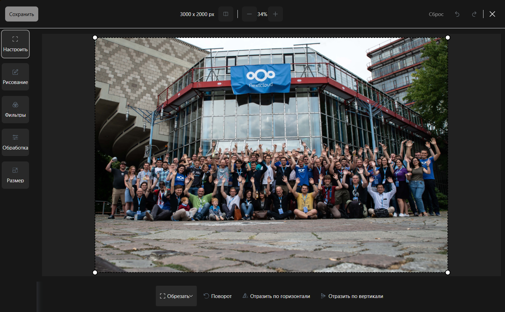 
   - Где вы можете выбирая параметры редактирования слевой стороны выбирать доступные инструменты редактирования под изображением.
   - Для сохранения результатов редактирования нажмите `Сохранить` в левом верхнем углу.

   
         
---------------------------------------------------------------------------------------------   

5. **Далее**  
   - 📂 [Работа с файлами](./Работа_с_файлами.md)
   - 📂 [Работа с изображениями](./Работа_с_изображениями.md)
   - 📂 [Работа с событиями](./Работа_с_событиями.md)
   - 📂 [Работа с календарём](./Работа_с_календарём.md)
   - 📂 [Работа с заметками](./Работа_с_заметками.md)
---
🔙 [Назад к 📂 Общее описание](./Общее_описание.md)   

   
 