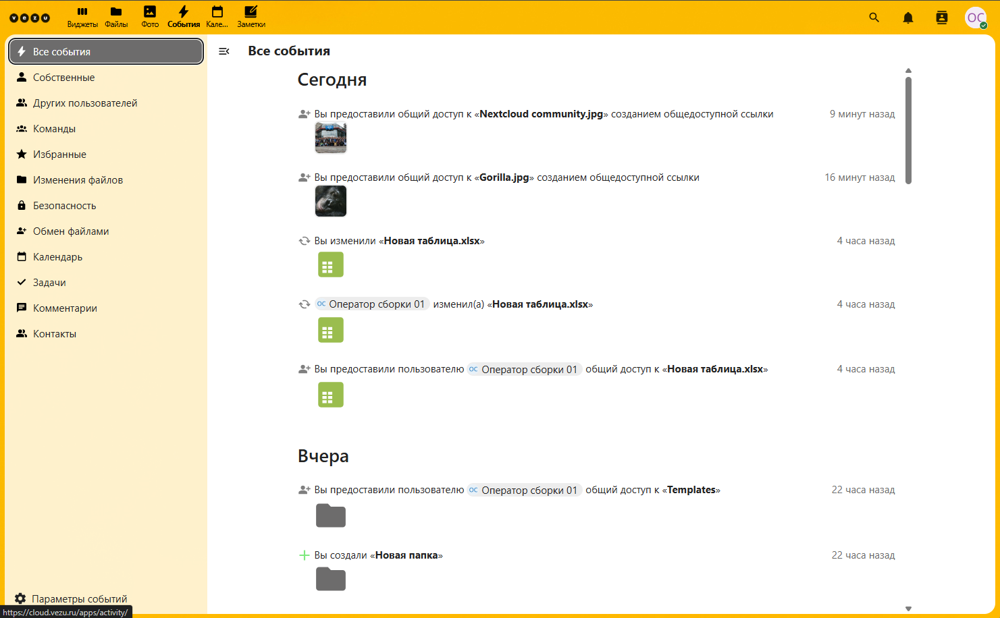
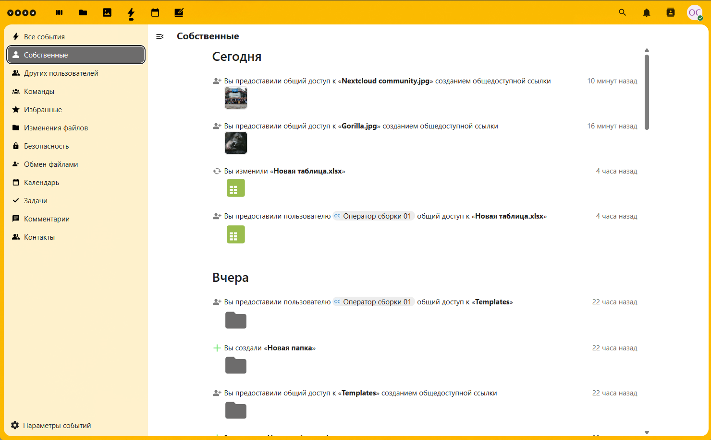
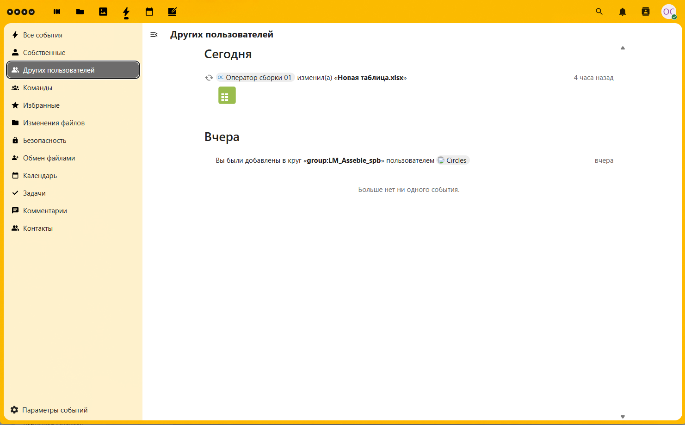
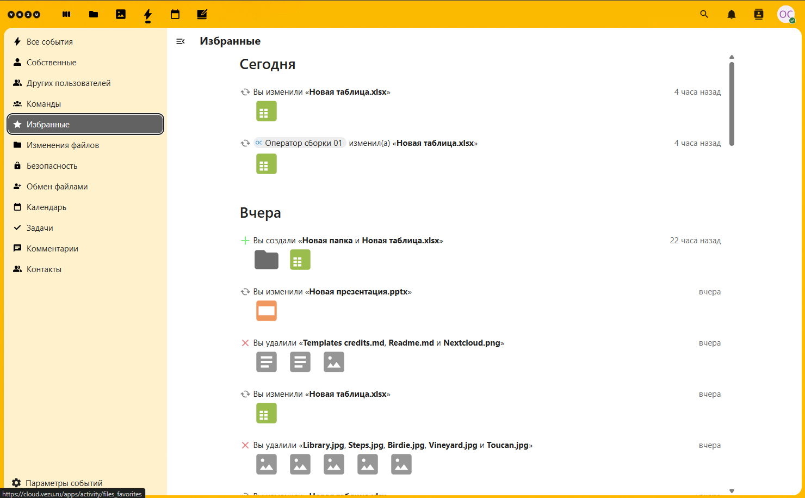
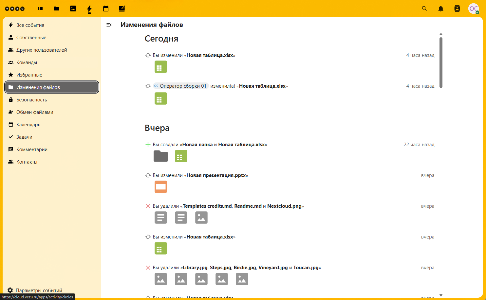
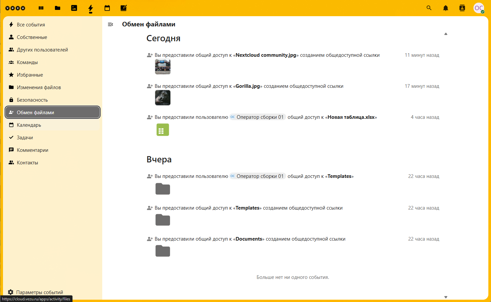

# Общее описание интрефейса облака Cloud.vezu.ru

 

## Просмотр и работа с `Событиями`
1. **Первоначальный вид рабочего пространства События** 
   - Основное окно **События**
   
   
   - Пункт меню в левой колонке `Все События` отображает все произошедшие события на облачном ресурсе.   
   - Пункт меню в левой колонке `Собственные` отображает события инициатором которых были вы.
      
       
   - Пункт меню в левой колонке `Других пользователей` отображает действия пользователе которым вы предоставили доступ к своим файлам.

      
   - Пункт меню в левой колонке `Команды` отображает действия пользователей группы над общими файлами.
   - Пункт меню в левой колонке `Избранный` отображает избранные действия над общими файлами.

     
   - Пункт меню в левой колонке `Изменения файлов` отображает действия в ходе который произшли какие-либо изменения с файлами.

     
   - Пункт меню в левой колонке `Обмен файлами` отображает действия в ходе который произшли обмены файлами.

           
2. **Параметры событий** (внизу с лева в углу )
   
   - Предоставляет возможность перенаправления на страницу настароек уведомлений.  
   

---------------------------------------------------------------------------------------------   

5. **Далее**  
   - 📂 [Работа с файлами](./Работа_с_файлами.md)
   - 📂 [Работа с изображениями](./Работа_с_изображениями.md)
   - 📂 [Работа с событиями](./Работа_с_событиями.md)
   - 📂 [Работа с календарём](./Работа_с_календарём.md)
   - 📂 [Работа с заметками](./Работа_с_заметками.md)
---
🔙 [Назад к 📂 Общее описание](./Общее_описание.md)   

   
 