# Общее описание интрефейса облака Cloud.vezu.ru

 

## Работа с `Файлами`
1. **Первоначальный вид рабочего пространства Работа с файлами** 
   
   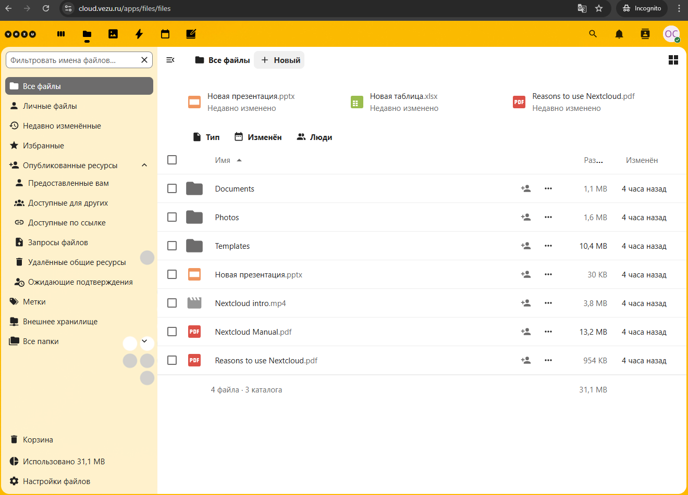
   
   - Пункт меню в левой колонке `Все файлы` отображает все доступные файлы и папки пользователя   
   - Пункт меню в левой колонке `Корзина` работает также как в ** Windows** т.е. удалённые файлы сначала помещаются туда и затем их можно/нужно удалить из `Корзины`.
  
2. **Создание нового элемента** (в верхну под заголовком кнопка `+ Новый`)
   
   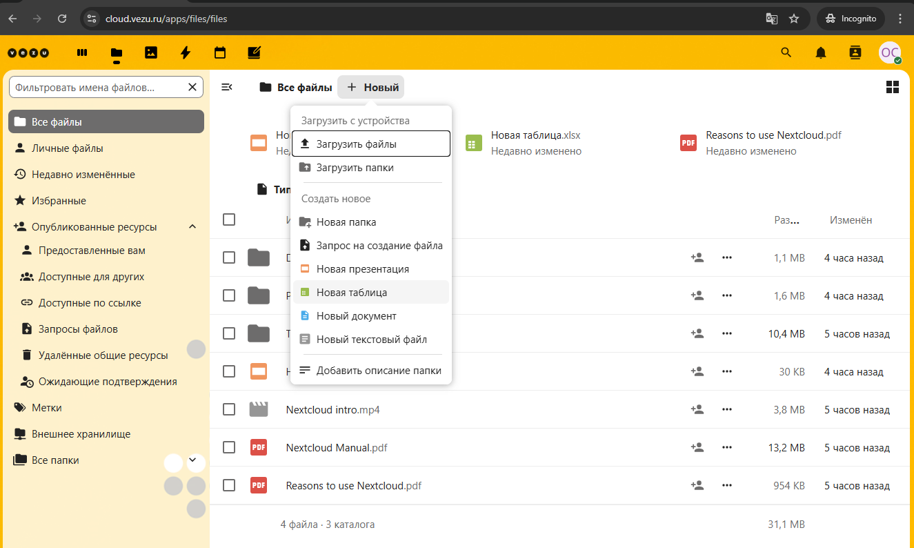
   
   - `+ Новый`: содержит список действий по типу создания новых документов.  
   - `Загрузить файлы`: для загрузки файлов, откроется окно проводника по выбору файла.
   - `Загрузить папки`: для загрузки папок, откроется окно проводника для выбора папки.
   - `Новая таблица`: создасе в открытой папке новый документ **Excel** `xlsx`
   - `Новый документ`: создаст в открытой папке новый документ **Word** `docx`
   - `Новый текстовый файл`: создаст файл в формате `txt`

3. **Добавление файла или папки перетаскиванием** (в верхенем правом углу)
   
   - 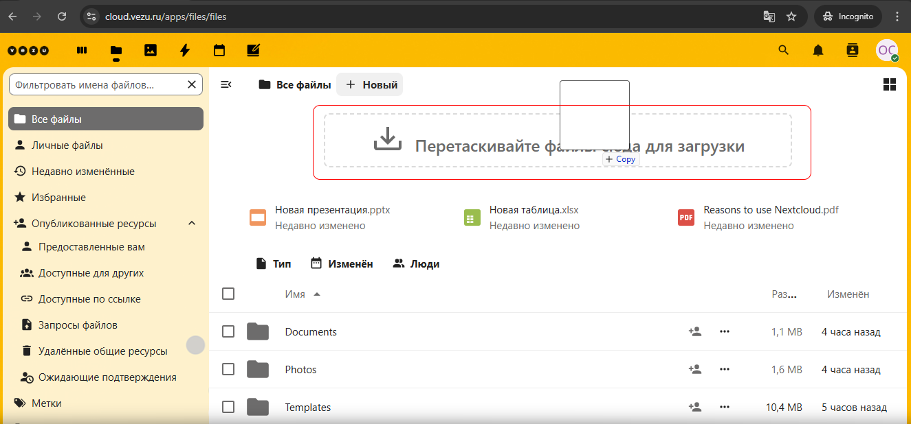
   - При добавлении файла или папки методом **перетаскивания** нужно обязательно перетаскивать файлы или папки именно на выделенную пунктиром прямоугольную область обозначенную надписью `Перетаскивайте файлы сюда для загрузки` имеено в эту область, а не куда попало :)

4. **Дополнительные элементы упарвления файлами и папками**  
   - `Три горизонтальные точки`: Позволяют установить метку, переместить скопировать, посмотреть подробрности, установить напоминание, удалить, редактировать локально т.е. скачав файл на ПК/ноутбук/планшет/смартфон
   
      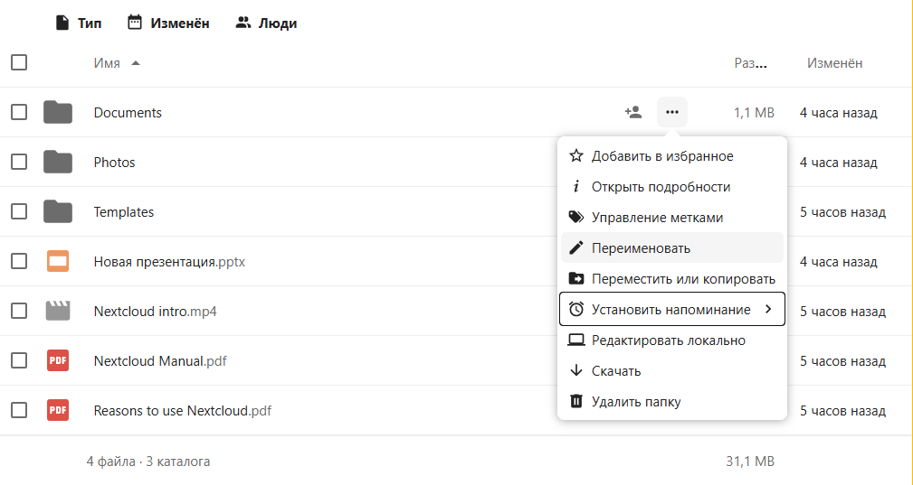
   - `Три точки `: Переместить, скопировать или удалить отмеченный галочкой объект, в данном примере файл, таким же образом можно удалить папку.

      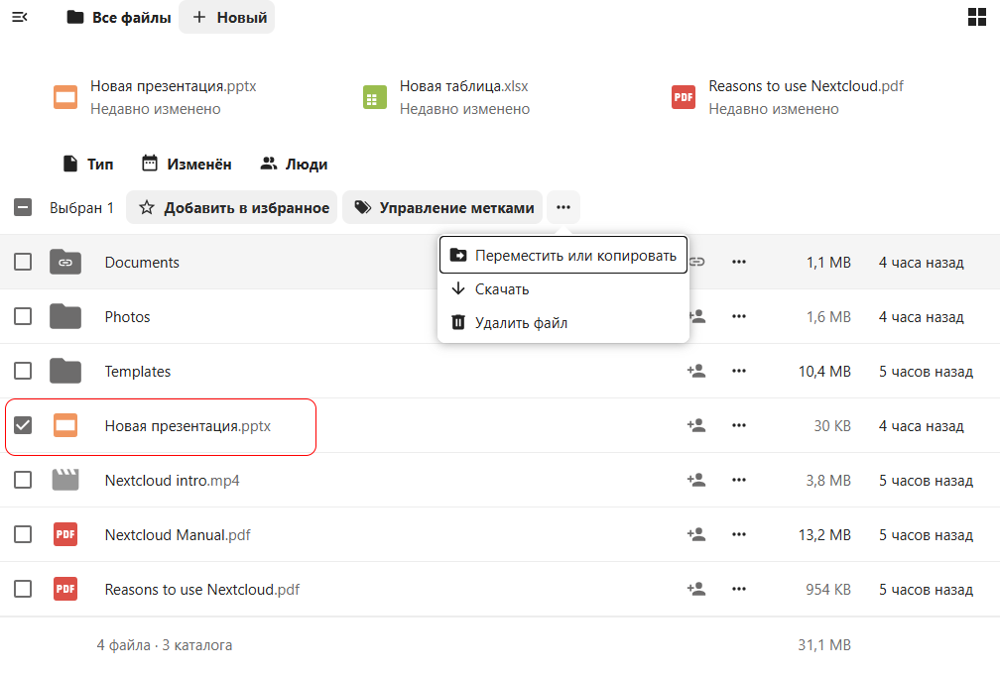
   - `Поделиться файлом с пользователем`: Нужно кликнуть на иконку человека со значком `+` с права

      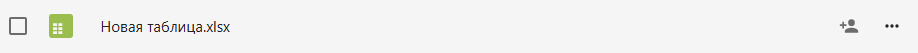
      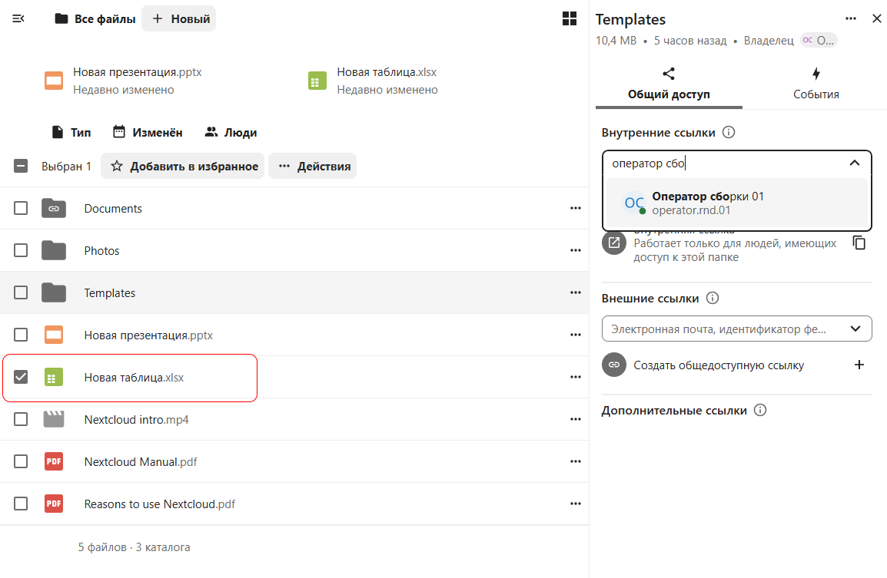
   - В появившимся окне нужно начать вводить имя пользователя с которым хотите поделиться   файлом или папкой для совместной работы, сработает автоподбор и далее будет предложено установить права доступа к файлу, только чтение, чтение и редактирование или полный доступ т.е. плюс удаление и полная замена.   

      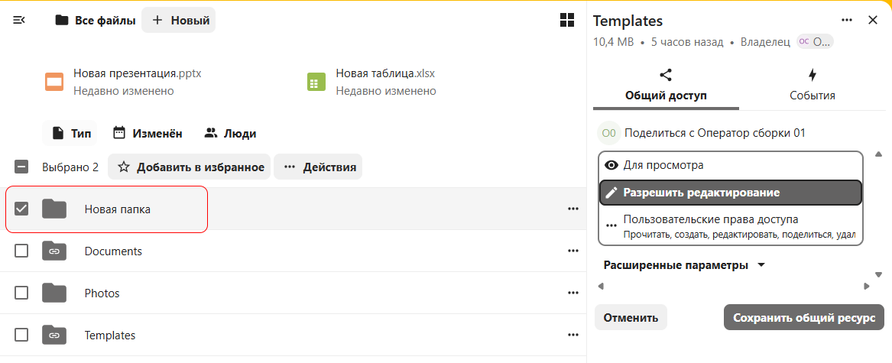
   - Выбрав тип `Индивидуальная ссылка` можно настроить доступ к файлу для внешних пользователей. Установить срок действия ссылки, по окончании которого, файл станет недоступен внешним пользователям, а также установить возможносто помимо просмотра по умолчанию, редактировавть файл.   
      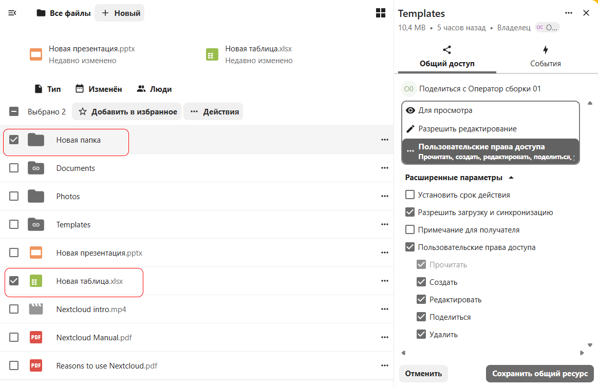
   - В **Событиях** можно простмотреть предоставленные разрешения на файл или папку

      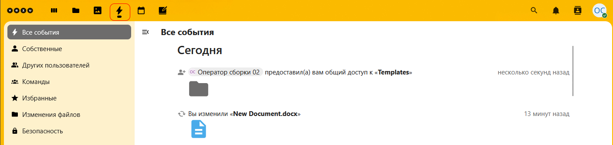
   - Также изменения отобразятся в разделе **Виджеты** и на стартовой странице

      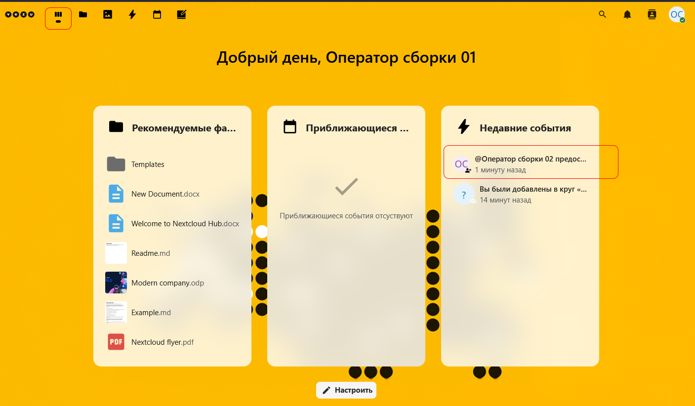
   - В разделе **Файлы** будет отмечен пользователь который поделился файлом или папкой

      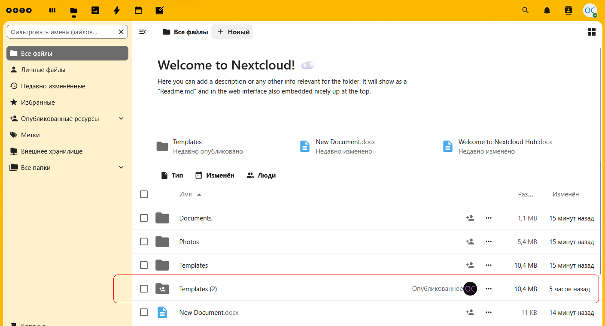
   - В секции слева **Опубликованные ресурсы** можно просмотреть предостваленные в общий доступ файлы вам, файлы которые вы пердоствили в общий доступ и доступные по ссылке файлы

      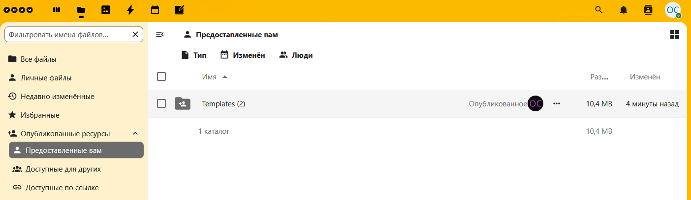
      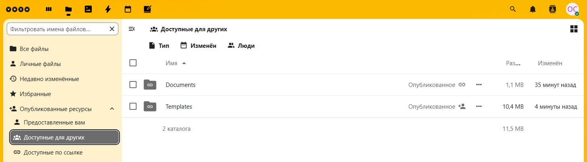
   - При одновременной работе с одним документом, пользователи работающие с документом будут перечислены в правом верхнем углу документа. Изменения применяются сразу и будут отображены у остальных пользователей одновременно.

      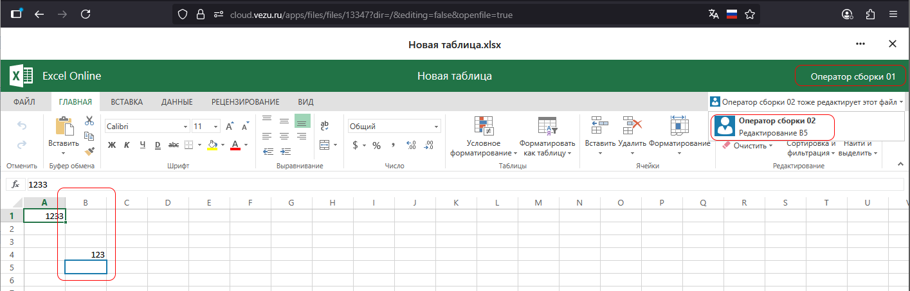   
5. **Секция Все папки**  
   -  `Все папки`: Добавлена для отображения дерева папок в профиле пользователя 
      
      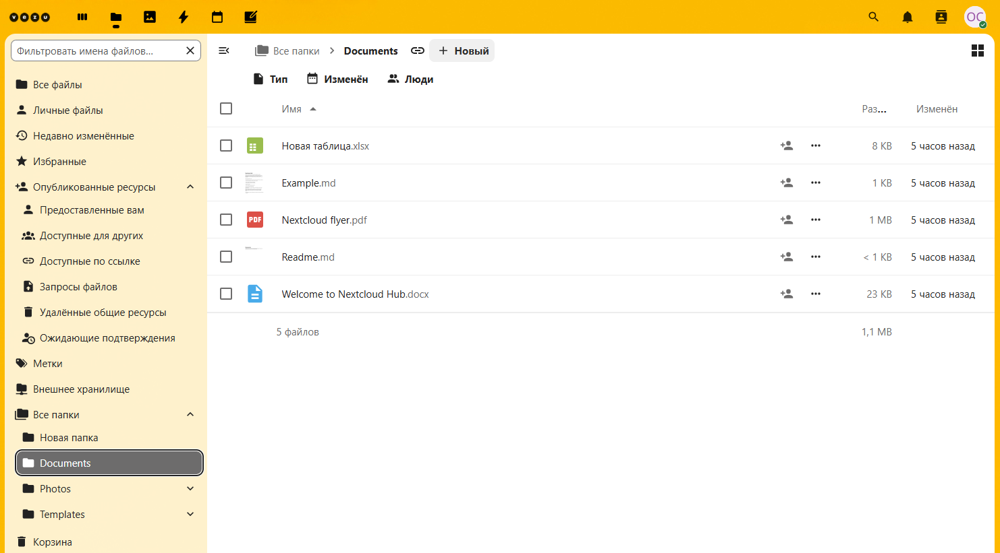
   
         
---------------------------------------------------------------------------------------------   

5. **Далее**  
   - 📂 [Работа с файлами](./Работа_с_файлами.md)
   - 📂 [Работа с изображениями](./Работа_с_изображениями.md)
   - 📂 [Работа с событиями](./Работа_с_событиями.md)
   - 📂 [Работа с календарём](./Работа_с_календарём.md)
   - 📂 [Работа с заметками](./Работа_с_заметками.md)
---
🔙 [Назад к 📂 Общее описание](./Общее_описание.md)   

   
 